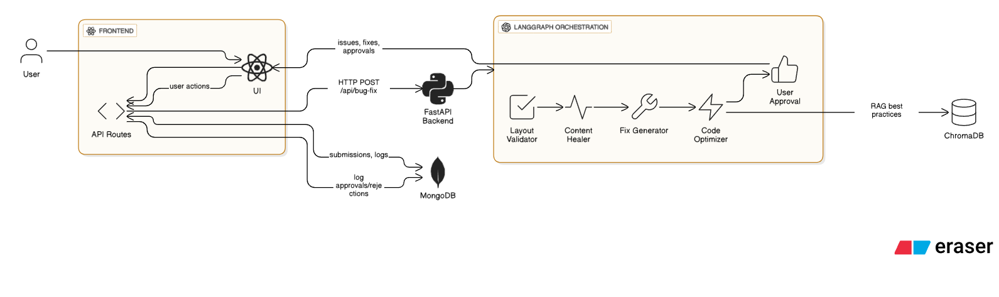

# Agentic AI-Based Bug Fixer for Generated Websites

## Overview
This project is an end-to-end AI-powered debugging assistant for web code (HTML, CSS, JavaScript). It uses a multi-agent system orchestrated with [LangGraph](https://github.com/langchain-ai/langgraph) and [LangChain Agents](https://python.langchain.com/docs/modules/agents/) to automatically detect, suggest, and optimize fixes for layout, logic, and content issues in websites. The backend is built with FastAPI, and the frontend is a modern Next.js/React app.

---

## Architecture Diagram




- **Frontend (Next.js/React):** Handles UI, user uploads, and also provides API routes for MongoDB (saving/fetching submissions, issues, fixes, approvals, audit logs, etc.).
- **FastAPI Backend:** Purely for AI bug-fixing workflow (LangGraph agents). No direct DB access.
- **LangGraph Agent Workflow:** Orchestrates all AI agents for bug detection, fix suggestion, optimization, and approval.
- **MongoDB:** Accessed only via Next.js API routes (not by FastAPI). Used for storing all user data, issues, fixes, and logs.
- **ChromaDB:** Used by the Code Optimizer agent for RAG-based best practices.

---

## Project Flow

1. **User uploads HTML, CSS, JS via the frontend.**
2. **Frontend sends code to FastAPI backend.**
3. **FastAPI orchestrates a LangGraph workflow:**
    - **Layout Validator Agent:** Detects layout issues (overlaps, responsiveness, z-index, etc.)
    - **Content Healer Agent:** Flags broken logic, placeholders, missing images, JS errors
    - **Fix Generator Agent:** Suggests code patches (before/after snippets)
    - **Code Optimizer Agent (RAG):** Recommends best practices using a ChromaDB knowledge base
    - **User Approval Agent:** Summarizes changes, presents side-by-side previews, and logs user decisions
4. **Frontend displays issues, fix suggestions, and manual fix requirements.**
5. **User can approve/reject fixes; all actions are logged for transparency.**

---

## Backend: LangGraph & LangChain Agents

### LangGraph
- **LangGraph** is a framework for building agentic workflows as directed graphs.
- Each node is an agent (e.g., validator, healer, fixer, optimizer, approval).
- Edges define the flow: output from one agent is input to the next.
- Enables modular, explainable, and extensible agent pipelines.

### LangChain Agents
- Each agent is implemented as a LangChain agent with its own prompt, tools, and logic.
- **Layout Validator:** Uses BeautifulSoup, regex, and CSS parsers to find layout bugs.
- **Content Healer:** Checks for lorem ipsum, missing images, JS errors, broken links.
- **Fix Generator:** Suggests code changes using LLM tools; if not possible, flags for manual fix.
- **Code Optimizer:** Uses RAG (Retrieval-Augmented Generation) with ChromaDB and a best-practices PDF corpus to suggest improvements.
- **User Approval:** Summarizes all changes, provides before/after previews, and logs user decisions.

### FastAPI Endpoints
- `/api/bug-fix` (POST): Accepts `{ input_data: { html, css, javascript } }`, returns structured JSON with issues, fixes, optimizations, and manual fix requirements.
- CORS enabled for frontend-backend communication.
- All agent outputs are logged for audit and learning.

---

## Example FastAPI Response
```json
{
  "result": {
    "status": "pending",
    "issues": [ ... ],
    "dashboard": {
      "diff_views": [ ... ],
      "manual_fix_required": [
        { "issue": "Broken image in footer line 52", "reason": "Cannot auto-fix missing image source." }
      ]
    },
    "optimizations": [ ... ],
    "message": "Changes require user approval"
  }
}
```

---

## Frontend: Next.js/React

- **CodeUpload:** User pastes HTML, CSS, JS. On submit, calls FastAPI `/api/bug-fix` endpoint.
- **IssueReport:** Displays detected issues in a readable format.
- **FixPreview:** Shows before/after code snippets for each fix.
- **ApprovalDashboard:** Presents all changes, including manual fix requirements, for user approval.
- **AuditLog:** Logs all user actions and agent decisions for transparency.

### How the Frontend Calls FastAPI
- Uses `fetch('http://127.0.0.1:8000/api/bug-fix', { ... })` to send code for analysis.
- Handles CORS automatically (FastAPI is configured for it).
- Parses the backend response and updates UI components accordingly.
- Displays both automated and manual fix requirements for user review.

---

## Key Technologies
- **LangGraph:** Agent workflow orchestration
- **LangChain Agents:** Modular, prompt-driven agents
- **ChromaDB:** RAG for code optimization
- **FastAPI:** High-performance Python API
- **Next.js/React:** Modern, responsive frontend
- **MongoDB:** For storing submissions, issues, and logs

---

## How to Run

1. **Backend:**
    - Install dependencies: `pip install -r requirements.txt`
    - Start FastAPI: `uvicorn api:app --reload`
2. **Frontend:**
    - Install dependencies: `npm install`
    - Start Next.js: `npm run dev`
3. **Open** [http://localhost:3000](http://localhost:3000) and upload your code!

---

## Extending the System
- Add more agents (e.g., accessibility checker, SEO auditor)
- Integrate with CI/CD for automated patching
- Enhance the UI for selective fix approval
- Store all actions in a database for analytics

---

## Credits
- Built with [LangGraph](https://github.com/langchain-ai/langgraph), [LangChain](https://python.langchain.com/), [FastAPI](https://fastapi.tiangolo.com/), [Next.js](https://nextjs.org/), [MongoDB](https://www.mongodb.com/) and [ChromaDB](https://www.trychroma.com/).

---

## Example UI Flow

1. User uploads code
2. Issues and fixes are displayed
3. Manual fix requirements are highlighted
4. User approves or rejects changes
5. All actions are logged for transparency

---

## Contact
For questions or contributions, open an issue or pull request on this repository.

Used free llm resource(gemini-1.5.-flash) with limitations in Input/Output token and raised ResourceExhausted: 429 Resource has been exhausted (e.g. check quota)..  
